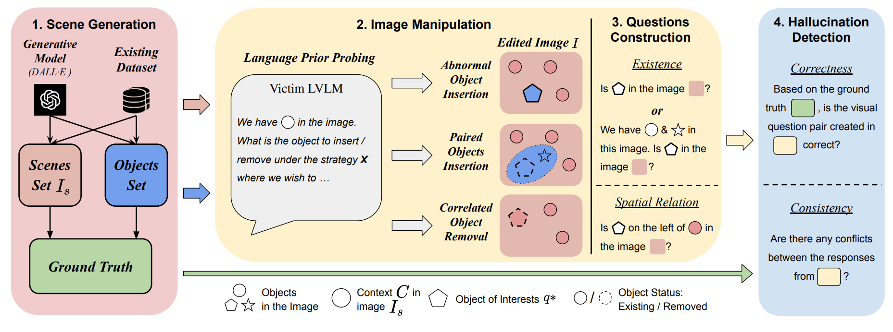

# AUTOHALLUSION: Automatic Generation of Hallucination Benchmarks for Vision-Language Models

[Xiyang Wu*](https://wuxiyang1996.github.io/), [Tianrui Guan*](https://tianruiguan.phd), Dianqi Li, Shuaiyi Huang, Xiaoyu Liu, Xijun Wang, Ruiqi Xian, Abhinav Shrivastava, Furong Huang, Jordan Lee Boyd-Graber, Tianyi Zhou, Dinesh Manocha

**[Paper](https://arxiv.org/abs/2406.10900)** | **[Twitter](https://x.com/terryguan97/status/1814757000066253120)** | **[Website](https://wuxiyang1996.github.io/autohallusion_page/)** | **[Hugging Face](https://huggingface.co/spaces/wuxiyang/AUTOHALLUSION)** | **[Code](https://github.com/wuxiyang1996/AutoHallusion)** | **[Dataset](https://github.com/wuxiyang1996/AutoHallusion?tab=readme-ov-file#benchmark)**

<p align="center" >
      
</p>

## Updates
- [10/03/2024] 🔥 We release a benchmark datasest generated by **AUTOHALLUSION** (also includes **[HallusionBench](https://arxiv.org/abs/2310.14566) data)** and update the [leaderboard](https://github.com/wuxiyang1996/AutoHallusion/?tab=readme-ov-file#leaderboard).
- [09/20/2024] 🔥 Our **[AUTOHALLUSION](https://arxiv.org/abs/2406.10900)** is accepted by **[EMNLP 2024](https://2024.emnlp.org/)**.
- [07/20/2024] 🔥 We launched our **[website](https://wuxiyang1996.github.io/autohallusion_page/)** for **[AUTOHALLUSION](https://arxiv.org/abs/2406.10900)**.
- [06/15/2024] 🔥 We release our early version of **[AUTOHALLUSION](https://arxiv.org/abs/2406.10900)**, as an extension of our prior work **[HallusionBench](https://arxiv.org/abs/2310.14566)**.
- [02/26/2024] 🔥 Our **[HallusionBench](https://arxiv.org/abs/2310.14566)** is accepted by **[CVPR 2024](https://openaccess.thecvf.com/content/CVPR2024/html/Guan_HallusionBench_An_Advanced_Diagnostic_Suite_for_Entangled_Language_Hallucination_and_CVPR_2024_paper.html)**.
- [11/28/2023] 🔥 The full paper (HallusionBench) is uploaded and can be accessed **[here](https://arxiv.org/abs/2310.14566)**. The dataset is expanded and leaderboard is updated.
- [10/27/2023] 🔥 The **[leaderboard](https://paperswithcode.com/sota/visual-question-answering-vqa-on-3)** for HallusionBench and evaluation code is released! **Welcome to update your model on our leaderboard!**
- [10/24/2023] 🔥 The early report for HallusionBench with case analysis and insights is available **[here](https://arxiv.org/abs/2310.14566)**.


If you find our paper useful, please cite our paper:
```bibtex
@misc{wu2024autohallusionautomaticgenerationhallucination,
      title={AUTOHALLUSION: Automatic Generation of Hallucination Benchmarks for Vision-Language Models}, 
      author={Xiyang Wu and Tianrui Guan and Dianqi Li and Shuaiyi Huang and Xiaoyu Liu and Xijun Wang and Ruiqi Xian and Abhinav Shrivastava and Furong Huang and Jordan Lee Boyd-Graber and Tianyi Zhou and Dinesh Manocha},
      year={2024},
      eprint={2406.10900},
      archivePrefix={arXiv},
      primaryClass={cs.CV},
      url={https://arxiv.org/abs/2406.10900}, 
}

@misc{guan2023hallusionbench,
      title={HallusionBench: An Advanced Diagnostic Suite for Entangled Language Hallucination & Visual Illusion in Large Vision-Language Models}, 
      author={Tianrui Guan and Fuxiao Liu and Xiyang Wu and Ruiqi Xian and Zongxia Li and Xiaoyu Liu and Xijun Wang and Lichang Chen and Furong Huang and Yaser Yacoob and Dinesh Manocha and Tianyi Zhou},
      year={2023},
      eprint={2310.14566},
      archivePrefix={arXiv},
      primaryClass={cs.CV}
}
```

## Dependency
Install the dependencies with `pip install -r requirements.txt`

OR

1. Install **[PyTorch](https://pytorch.org/)** (We use 2.2.2)
2. Install object detection model **[OWL-ViT](https://huggingface.co/docs/transformers/en/model_doc/owlvit)**: `pip install transformer` and follow the instructions provided in the [link](https://huggingface.co/docs/transformers/en/model_doc/owlvit).
3. Install LVLMs: `pip install openai` or other LVLMs to be evaluated.
4. Other dependencies: `pip install opencv-python numpy tqdm pillow rembg`

## Benchmark
We provide a benchmark including hallucination cases created by abnormal object insertion, paired object insertion and 
correlated object removal strategies, from both synthetic and real-world images. 

To keep evaluation simple, we only provide the question in form of yes/no questions.

| Updated on  |            Questions and Annotations             |                                             Figures                                             | Dataset Size |
|-------------|:------------------------------------------------:|:-----------------------------------------------------------------------------------------------:|:------------:|
| Oct 3, 2024 | [autohallusion_data.json](https://drive.google.com/file/d/17yrpbLrtd4MmqNFE1ET5qxksea7i5u-x/view?usp=drive_link) | [image.zip](https://drive.google.com/file/d/1HsbIPw8wslRpBswSZygp6YhBMqUHvfVW/view?usp=drive_link) |     3129     |

## Demo
We provide a few light-weight demos to help users quickly understand the usage of different strategies provided by 
our AutoHallusion pipeline and craft hallucination cases.

### Hugging Face
We provide **[an interactive online Hugging Face demo](https://huggingface.co/spaces/wuxiyang/AUTOHALLUSION)** for users 
to craft hallucination cases easily using either strategies of AutoHallusion, with synthetic images generated from text 
or uploaded images.

### Jupyter Notebook
We provide three jupyter notebooks **[Abnormal Object Insertion](./abnormal_obj_insertion.ipynb)**, 
**[Paired Object Insertion](./paired_obj_insertion.ipynb)** and **[Correlated Object Removal](./corr_obj_removal.ipynb)**.
We provide illustrative comments along with each code block with visualization of results to help users understand the 
purpose of each step throughout the whole hallucination crafting procedure. 

## Usage
### Hallucination Case Crafting
We provide codebase to automatically scale up the benchmark using AutoHallusion.
{strategy name} could be replaced with **Abnormal Object Insertion**, **Paired Object Insertion** and 
**Correlated Object Removal**.

`run_{strategy name}.py`: Hyper-parameters and experiment flags for hallucination case crafting.
`main_{strategy name}.py`: Main function for hallucination case crafting, including the scene image generation, image 
manipulation, question construction and hallucination detection. The specific strategy is determined by chosen 
hyper-parameters and experiment flags.

### Utilities
`utils_merge.py`: A general function to determine LVLM-related functions for scene image generation, object prompting, 
VQA, etc. The specific LVLM is decided by `object thinking` (for scene and object prompting) and `image caption` 
(for VQA tasks) in the hyper-parameters.
`utils_{model name}_clean.py`: All LVLM-related functions for scene image generation, object prompting, VQA, etc., given 
the LVLM specified by `{model name}`.
`utils_eval.py`: All evaluation functions for hallucination detection, supported by **GPT-4V-Turbo**.
`utils.py`: All other non-LVLM-related functions, including object detection, image editing, background removal, ground
truth generation etc.

## Leaderboard
### Evaluation
We evaluate each model's performance over benchmark created by AutoHallusion. The evaluation procedure for each model 
to get the results presented in the leaderboard includes:

**Step 1**: Install the **[Questions and Annotations](https://drive.google.com/file/d/17yrpbLrtd4MmqNFE1ET5qxksea7i5u-x/view?usp=drive_link)**
and **[Image](https://drive.google.com/file/d/1HsbIPw8wslRpBswSZygp6YhBMqUHvfVW/view?usp=drive_link)**. Setup model to be evaluated.

**Step 2**: We run the VQA tasks for each model over the question-image pair in the benchmark to get the answer, 
using the inference code for each model we provided **[GPT-4V-Turbo](./eval/autohall_gpt.py)**, 
**[Gemini Pro Vision](./eval/autohall_gemini.py)** and **[Claude 3](./eval/autohall_claude3.py)**. 
Results are stored in the `autohallusion_data_{model name}_res.json`.

**Step 3**: We run **[evaluation code](./eval/eval_code.py)** that uses **GPT-4V-Turbo** to determine if the answer produced
by the models conveys the same meaning as the ground truth. Results produced by `autohallusion_data_{model name}_res_evaluated.json`.
are presented as breakdowns of accuracy values over examples from different categories, as presented in the leaderboard.

### Metric
The metrics on the leaderboard we provide include:
* **Overall Accuracy:** The question-answering accuracy over the whole benchmark.
* **Breakdown (over Synthetic/Real-world Dataset)**
    * **Overall Accuracy:** The question-answering accuracy over examples generated from **Synthetic/Real-world images**.
    * **Existence Accuracy:** The question-answering accuracy for **existence questions** over examples generated from **Synthetic/Real-world images**.
    * **Spatial Relation Accuracy:** The question-answering accuracy for **spatial relation questions** over examples generated from **Synthetic/Real-world images**.

| Model                 | Overall Acc. | Overall Acc. (Synthetic) | Exi. Acc. (Synthetic) | Sp. Acc. (Synthetic) | Overall Acc. (Real-world) | Exi. Acc. (Real-world) | Sp. Acc. (Real-world) |
|-----------------------|:------------:|:------------------------:|:---------------------:|:--------------------:|:-------------------------:|:----------------------:|:---------------------:|
| **GPT4V-Turbo**       |     66.0     |           68.5           |         68.3          |         68.8         |           62.9            |          71.5          |         56.3          |
| **Gemini Pro Vision** |     51.4     |           53.5           |         59.4          |         43.4         |           48.8            |          70.6          |         31.8          |
| **Claude 3**          |     37.1     |           37.3           |         44.6          |         24.7         |           36.9            |          55.6          |         22.4          |
| **LLaVA-1.5**         |     44.5     |           46.6           |         54.2          |         33.8         |           41.8            |          60.4          |         27.3          |
| **miniGPT4**          |     51.0     |           50.2           |         56.4          |         39.7         |           52.1            |          67.7          |         39.9          |


## License
This repository is under [BSD 3-Clause License](LICENSE.md).
